#  Simcity threejs version

> by:hexianWeb

# Threejs 游戏基建结构

| 要素         | 作用             | 类比现实                       |
| ------------ | ---------------- | ------------------------------ |
| **Scene**    | 游戏世界的3D环境 | 就像游乐场的场地               |
| **Game UI**  | 用户界面和交互层 | 相当于游乐场的指示牌和售票处   |
| **Metadata** | 游戏数据和逻辑   | 类似游乐场的运营规则和游客数据 |

# Metadata 设计

## BUILDING_DATA 数据结构说明

`BUILDING_DATA` 是一个包含所有建筑类型及其属性的常量对象，定义于 `src/constants/constants.js`。其结构如下：

```js
export const BUILDING_DATA = {
  [buildingType]: {
    name: { zh: '中文名', en: 'English Name' }, // 建筑名称（多语言）
    type: 'buildingType',                      // 建筑类型唯一标识
    icon: '🏠',                                // 图标（emoji或字符串）
    buildingType: { zh: '建筑类型', en: 'Type' }, // 建筑大类（多语言）
    category: 'residential' | 'industrial' | 'commercial' | 'environment' | 'governance' | 'social' | 'infrastructure', // 分类
    levels: {
      [level]: {
        displayName: { zh: '中文名', en: 'English Name' }, // 等级显示名
        cost: number,                // 建造消耗金币
        maxPopulation?: number,      // 最大人口（住宅类）
        powerUsage?: number,         // 用电量
        powerOutput?: number,        // 发电量（发电建筑）
        pollution: number,           // 污染值（负数为减污）
        coinOutput?: number,         // 金币产出（商业/工业）
        population?: number,         // 提供就业/人口（商业/工业/设施）
        upgradeCost?: number,        // 升级消耗金币
        nextLevel?: number,          // 下一级编号（无则为null）
        visible: boolean,            // 是否在UI可见
      },
      // ...更多等级
    }
  },
  // ...更多建筑类型
}
```

### 字段说明

- **name**：建筑的多语言名称，`zh` 为中文，`en` 为英文。
- **type**：建筑类型唯一标识（如 `house`, `factory`）。
- **icon**：建筑图标，通常为 emoji。
- **buildingType**：建筑大类（如“住宅建筑”、“工业建筑”），多语言。
- **category**：建筑所属分类，用于功能分组（如 `residential`、`industrial`）。
- **levels**：建筑的多级属性，key 为等级（1, 2, 3...），value 为该等级的详细属性对象。

#### levels 下的属性

- **displayName**：该等级的多语言显示名。
- **cost**：建造该等级建筑所需金币。
- **maxPopulation**：最大人口容量，仅住宅类有。
- **powerUsage**：用电量，部分建筑有。
- **powerOutput**：发电量，仅发电建筑有。
- **pollution**：污染值，负数表示减污（如公园）。
- **coinOutput**：金币产出，商业/工业建筑有。
- **population**：提供就业/人口，部分建筑有。
- **upgradeCost**：升级到下一级所需金币。
- **nextLevel**：下一级编号，无则为 null。
- **visible**：该等级是否在UI中可见。

### 示例

以住宅（house）为例：

```js
house: {
  name: { zh: '住宅', en: 'Residential' },
  type: 'house',
  icon: '🏠',
  buildingType: { zh: '住宅建筑', en: 'Residential Building' },
  category: 'residential',
  levels: {
    1: {
      displayName: { zh: '普通住宅', en: 'Basic Residential' },
      cost: 300,
      maxPopulation: 50,
      powerUsage: 10,
      pollution: 2,
      upgradeCost: 600,
      nextLevel: 2,
      visible: true,
    },
    2: {
      displayName: { zh: '高级住宅', en: 'Advanced Residential' },
      cost: 600,
      maxPopulation: 100,
      powerUsage: 15,
      pollution: 3,
      upgradeCost: 1200,
      nextLevel: 3,
      visible: false,
    },
    3: {
      displayName: { zh: '豪华住宅', en: 'Luxury Residential' },
      cost: 1200,
      maxPopulation: 200,
      powerUsage: 20,
      pollution: 5,
      upgradeCost: null,
      nextLevel: null,
      visible: false,
    },
  },
}
```

---

### 设计原则

- **多语言支持**：所有显示相关字段均为 `{ zh, en }` 结构，便于国际化。
- **多级建筑**：通过 `levels` 字段支持建筑升级，每级有独立属性。
- **灵活扩展**：可轻松添加新建筑类型或扩展属性。
- **UI 可控**：`visible` 字段控制各等级在UI的显示与否。

---

如需进一步细化字段含义或扩展，请补充在此结构说明下方。

# SimObject  互动基类

> 提供了 mesh 管理、选中高亮、HTML 信息展示等通用交互能力。

- SimObject 提供了 mesh 管理、选中高亮、HTML 信息展示等通用交互能力。

- 只要是场景中可交互的对象（如 Tile、Building），都应继承 SimObject。

# building 类组件

## 🧠 分析与设计思路

1. 单一职责原则

- 0多态与扩展性

- 不同类型建筑继承自 Building，重写各自的功能方法（如 getPopulation、getPower、getEconomy）。

- 便于后续扩展新建筑类型或功能。

3. 解耦与协作

- Tile 只持有 Building 的实例（如 this.buildingInstance），通过接口与其交互。

- Building 需要能访问 Experience、scene、resources 等核心实例。

------

## 推荐实现步骤

### 1. 新建 building.js 基础类

- 负责加载建筑模型、通用属性（如 position、direction）、升级等。

- 提供通用接口（如 update、upgrade、get功能值等）。

### 2. 新建具体建筑子类（如 house.js、factory.js、shop.js）

- 继承 Building，重写/扩展功能方法。

### 3. 修改 Tile 类

- Tile 只负责地皮表现，持有 Building 实例。

- 通过接口与 Building 交互（如升级、获取功能值等）。

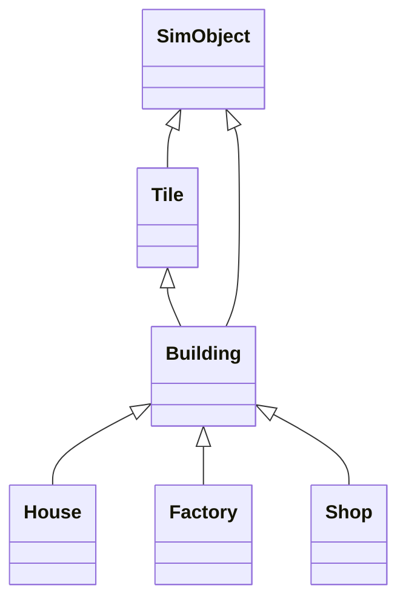

# Tile 地皮交互

## 1. 方案梳理

### 方案一：Tile 负责建筑实例

- 流程：射线检测命中 tile（地皮），直接调用 tile.userData.setBuilding('house', 0) 在 tile 内部生成建筑实例（如 House），并作为 tile 的子对象（mesh.add(buildingInstance)）。

- 特点：

- 建筑和地皮是父子关系，建筑始终附着在 tile 上。

- 交互、管理、拾取都通过 tile 进行。

- 删除/移动建筑时，直接操作 tile 实例。

### 方案二：Tile 和 Building 分离

- 流程：射线检测命中 tile，获取其 position.x/z，随后在 buildingsGroup（独立 group）中创建建筑实例，建筑与 tile 仅通过坐标关联。

- 特点：

- 地皮和建筑完全分离，建筑统一管理在 buildingsGroup。

- 需要额外的数据结构维护 tile 与 building 的映射关系。

- 移动/删除建筑时，需要先查找对应 tile，再操作 buildingsGroup。

------

## 2. 需求与扩展性分析

### PRD 需求

- 建筑与地皮一一对应，每个 tile 最多一个建筑。

- 需要支持建筑的放置、移动、删除。

- 未来可能有 tile 升级、建筑升级、地皮扩展等需求。

### 技术实现对比

| 维度       | 方案一（父子）             | 方案二（分离）               |
| :--------- | :------------------------- | :--------------------------- |
| 实现难度   | 简单，直接操作 tile        | 复杂，需维护映射关系         |
| 性能       | 高效，遍历 tile 即可       | 需遍历 buildingsGroup 或查表 |
| 扩展性     | 易于扩展（如 tile 升级）   | 灵活，但管理复杂             |
| 交互逻辑   | 直观，所有交互聚焦 tile    | 需同步 tile 与 building 状态 |
| 数据一致性 | 易保证（父子结构天然一致） | 需手动同步，易出错           |
| 未来扩展   | 支持 tile/建筑联动、升级等 | 支持建筑独立动画、批量操作等 |

### 代码风格与维护

- 你的框架强调通过 Experience 单例获取依赖，tile 作为地皮的核心单元，建筑作为 tile 的"内容"更符合直觉。

- 方案一更贴合"组合"思想，tile 作为容器，建筑作为内容，便于后续扩展 tile 的属性（如地皮类型、状态等）。

------

## 3. 推荐与理由

强烈推荐采用方案一（tile 负责建筑实例，建筑作为 tile 的子对象），理由如下：

1. 符合 PRD 需求：每个 tile 只允许一个建筑，tile 作为地皮的唯一管理者，建筑作为其内容，逻辑清晰。

1. 易于维护：所有操作（放置、删除、移动、升级）都只需操作 tile 实例，无需额外维护映射关系。

1. 高扩展性：未来如地皮扩展、建筑升级、tile 状态变化等，都可以在 tile 类中集中管理，便于统一调试和维护。

1. 性能优越：遍历 tile 即可获取所有建筑，无需遍历全场景或查找映射表。

1. 代码风格统一：符合你当前框架的单例与组件化设计，便于团队协作和后续开发。

------

## 4. 方案一的最佳实践建议

- tile.js 中的 setBuilding(type, direction) 方法负责创建/替换建筑实例，并将其作为 tile 的子对象。

- interactor.js 通过射线检测命中 tile 后，直接调用 tile.userData.setBuilding(...) 实现建筑放置。

- 建筑删除/移动：可在 tile 上实现 removeBuilding()、moveBuilding() 等方法，保持 tile 的唯一性和一致性。

- 建筑信息面板：通过 tile 统一获取建筑信息，便于展示和交互。

------

## 5. 方案二的适用场景

- 如果未来有建筑与 tile 多对多、建筑可跨 tile、建筑批量动画等需求，可以考虑方案二。但目前 PRD 明确是一一对应，方案一更优

# UI 交互

- UI 交互（如选择建筑、切换模式、点击地皮）目前只在前端 JS 层（index.js）和 HTML 层（index.html）生效。

- Three.js 场景中的建筑实际放置、删除、移动等操作由 tile/building 组件（如 tile.js、house.js）负责。

- 需要桥接：UI 事件 → Three.js 场景 & Three.js 场景 → UI 事件操作。

  - 用户在左侧面板选择建筑类型（如"FACTORY"）。

  - 用户切换到"BUILD"模式。

  - 用户点击画布（canvas）上的某个 tile，期望在该 tile 上放置所选建筑。

  - 用户切换到"DEMOLISH"模式，点击建筑，期望删除该建筑。

  - 用户点击建筑，右侧面板显示详细信息。

### 方案：mitt js 事件驱动（推荐）

- 全局状态：用  Experience 单例存储当前选中的建筑类型、操作模式。多用于 UI 事件 → Three.js 场景

  ```js
  export default class Experience extends EventEmitter {
    constructor(canvas) {
      super()
      // ...
      this.currentMode = 'build'
      this.selectedBuilding = null
      this.credits = 12345
      // ...
    }
  }
  ```

随后在 Ray 射线检测相关逻辑中读取全局变量相应状态并做不同逻辑操作

```js
// interactor.js
_onClick(_event) {
  if (this.focused) {
    if (this.experience.currentMode === 'build' && window.selectedBuilding) {
      this.focused.setBuilding(window.selectedBuilding)

    } else if (this.experience.currentMode === 'demolish') {
      this.focused.removeBuilding()
      // 可选：window.showToast('建筑已拆除')
    } else {
      // 显示信息面板
      const html = this.focused.toHTML()
      document.getElementById('info-panel').innerHTML = html
    }
  }
}
```

- 事件驱动：UI 事件只负责更新全局状态，Three.js 交互（如 Interactor）在射线命中 tile/building 时，读取全局状态并执行相应操作。Three.js 场景 → UI 事件

  ```js
  // experience.js / interactor.js
  import { eventBus } from './event-bus'
  eventBus.emit('building:placed', { tile, type })

  // index.js
  import { eventBus } from './event-bus'
  eventBus.on('building:placed', ({ tile, type }) => {
    showToast(`${type} 已放置在 (${tile.x}, ${tile.y})`, 'success')
    // ...刷新 UI
  })
  ```

## 典型需求场景

- 用户在左侧面板选择建筑类型（如"FACTORY"）。

- 用户切换到"BUILD"模式。

- 用户点击画布（canvas）上的某个 tile，期望在该 tile 上放置所选建筑。

- 用户切换到"DEMOLISH"模式，点击建筑，期望删除该建筑。

- 用户点击建筑，右侧面板显示详细信息

## 典型事件设计

### ① 建筑相关

| 事件名            | 触发时机               | 事件参数结构                     |
| :---------------- | :--------------------- | :------------------------------- |
| building:placed   | 成功放置建筑后         | { tile, type, buildingInstance } |
| building:removed  | 拆除建筑后             | { tile, type }                   |
| building:selected | 选中建筑（点击/hover） | { tile, type, buildingInstance } |
| building:upgraded | 建筑升级后             | { tile, type, level }            |

### ② 地皮/格子相关

| 事件名        | 触发时机   | 事件参数结构 |
| :------------ | :--------- | :----------- |
| tile:selected | 选中地皮   | { tile }     |
| tile:expanded | 地皮扩展后 | { newSize }  |

### ③ 模式/状态相关

| 事件名           | 触发时机                   | 事件参数结构 |
| :--------------- | :------------------------- | :----------- |
| mode:changed     | 操作模式切换（build/move） | { mode }     |
| building:choosed | 选择建筑卡片               | { type }     |

### ④ 资源/经济相关

| 事件名             | 触发时机 | 事件参数结构          |
| :----------------- | :------- | :-------------------- |
| credits:changed    | 金币变化 | { credits, delta }    |
| population:changed | 人口变化 | { population, delta } |

### ⑤ UI 相关

| 事件名        | 触发时机       | 事件参数结构      |
| :------------ | :------------- | :---------------- |
| ui:toast      | 需要弹出提示时 | { message, type } |
| ui:panel:show | 显示信息面板   | { panel, data }   |

# 建筑四大模式

## 1. SELECT（选择）模式
**核心功能**：信息查看与建筑升级
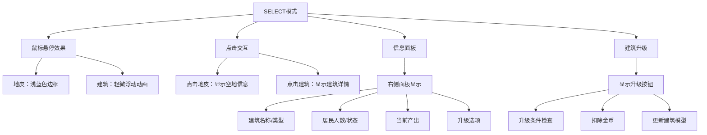

**实现要点**：
- 视觉反馈：
  - 悬停地皮：浅蓝色半透明边框
  - 悬停建筑：Y轴轻微浮动(0.2单位 gsap ease )+发光效果
- 信息面板内容：
  ```js
  // 建筑信息示例
  {
    name: "高级公寓",
    type: "住宅",
    residents: "12/15",
    status: "正常", // 状态标签颜色：正常-绿色，拥挤-橙色，空置-灰色
    output: "+5.2金币/秒",
    nextLevel: {
      cost: 1500,
      benefits: "+2居民容量"
    }
  }
  ```
- 交互限制：
  - 禁用放置/删除操作
  - 升级按钮仅在满足条件时可用

  ```mermaid
  graph TD
    A[用户鼠标点击/移动] --> B[Interactor 监听事件]
    B --> C[获取当前模式: SELECT]
    C --> D[获取射线焦点 Tile]
    D --> E[高亮/选中 Tile]
    E --> F[调用 _handleSelectMode]
    F --> G[更新 Pinia: selectBuilding/selectPosition]
    G --> H[UI 组件监听 Pinia 状态]
    H --> I[App.vue 及子组件响应, 展示详情/高亮]
  ```

### upgrade, demolish 升级功能

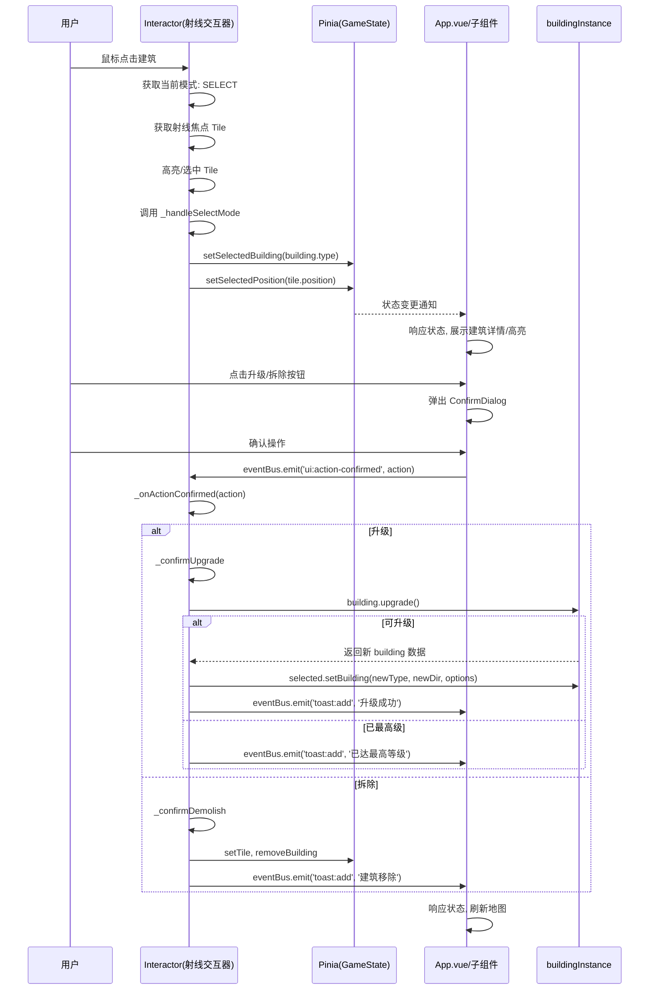

## 2. BUILD（建造）模式

**核心流程**：

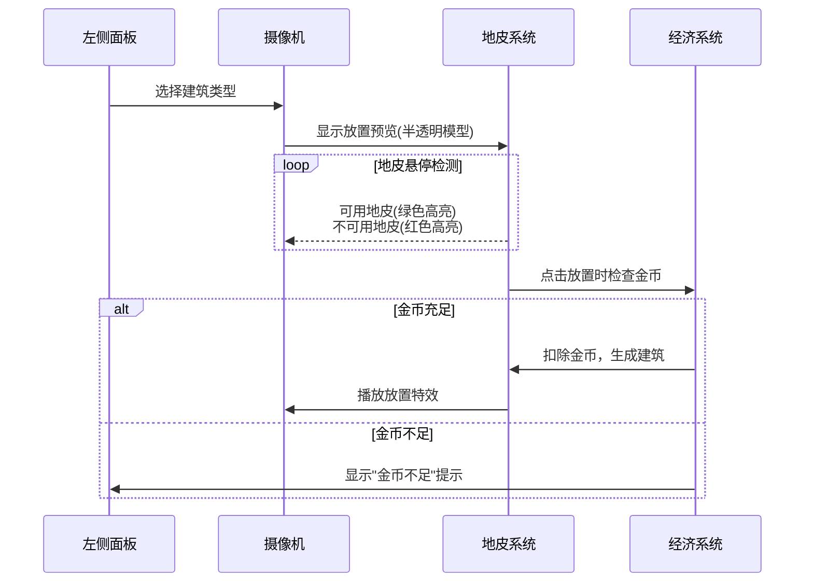

**关键实现**：
```js
// 在Interactor.js中的实现
_onClick() {
  if (this.experience.currentMode === 'build') {
    const cost = Building.getCost(selectedBuildingType);

    if (this.experience.credits >= cost) {
      this.focusedTile.setBuilding(selectedBuildingType);
      this.experience.credits -= cost;
      eventBus.emit('credits:changed', {
        credits: this.experience.credits,
        delta: -cost
      });
    } else {
      eventBus.emit('ui:toast', {
        message: `金币不足！需要 ${cost} 金币`,
        type: 'error'
      });
    }
  }
}
```

**UI提示要素**：
1. 左侧面板：
   - 当前选中建筑卡片：金色边框+放大效果
   - 建筑价格显示（红色标注不足金额）
2. 场景内：
   - 可用地皮：绿色网格高亮
   - 不可用地皮：红色网格闪烁
   - 建筑预览：50%透明度的3D模型
3. 状态栏：
   - 实时金币计数（放置时跳动减少）

## 3. RELOCATE（移动）模式
**状态机实现**：
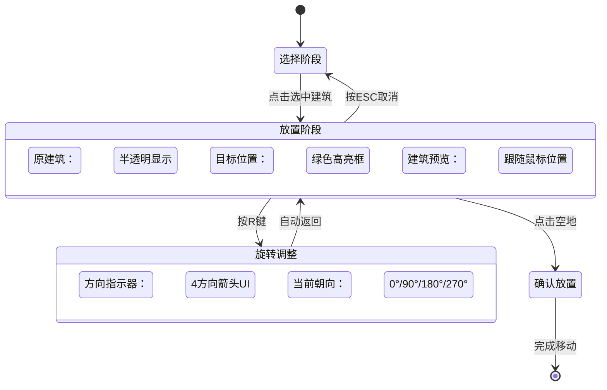

**技术要点**：
```js
// 在Experience.js中
startRelocation(building) {
  this.relocatingBuilding = building;
  this.originalTile = building.parentTile;
  this.originalTile.setBuilding(null, true); // 临时移除

  // 创建预览模型
  this.previewModel = building.clone();
  this.previewModel.material.transparent = true;
  this.previewModel.material.opacity = 0.7;
}

// 旋转处理
rotatePreview(angle = 90) {
  this.previewRotation = (this.previewRotation + angle) % 360;
  this.previewModel.rotation.y = THREE.MathUtils.degToRad(this.previewRotation);
}

// 确认放置
confirmRelocation(targetTile) {
  targetTile.setBuildingInstance(this.relocatingBuilding);
  this.relocatingBuilding.setRotation(this.previewRotation);
  this.cleanupPreview();
}
```

**视觉反馈**：
1. 选中建筑：半透明化（opacity: 0.5）
2. 预览模型：70%透明度+发光轮廓
3. 有效目标地皮：脉动绿色光圈
4. 无效目标地皮：静态红色边框
5. 方向指示器：底部罗盘UI（显示当前朝向）

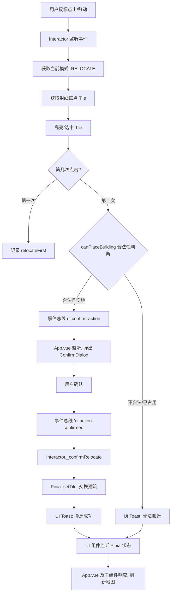

## 4. DEMOLISH（拆除）模式

**安全交互流程**：
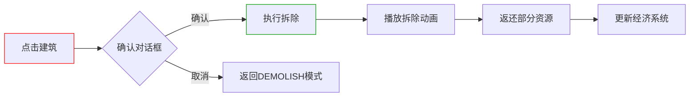

**视觉提示**：
1. 场景内：
   - 所有建筑：显示红色边框
   - 悬停建筑：脉动红色警示效果
2. 光标变化：
   - 默认：红色禁止图标
   - 悬停建筑：锤子图标
3. 确认对话框：
   - 半透明黑色蒙层
   - 居中红色边框面板
   - 拆除图标动画

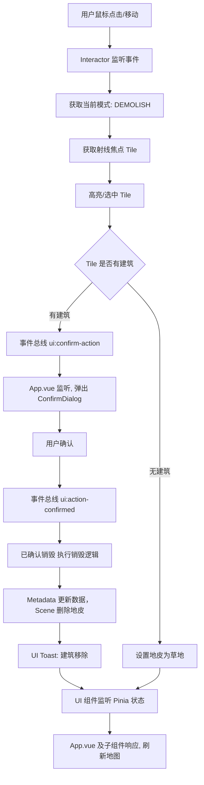

# 产出系统

## 1.人口资源

### 1. 机制说明
- **住宅建筑**（如🏠、🏡）只决定"人口容量"上限（maxPopulation 字段）。
- **商业/工业建筑**（如🏭、🧪、🏬、🏢）提供就业岗位（population 字段），吸纳实际人口。
- **实际人口** = 所有商业/工业建筑的岗位总和，不能超过人口容量。
- **人口利用率** = 实际人口 / 人口容量。
- 当人口利用率 > 1.5 或 < 0.5 时，满意度下降。
- 满意度过低会导致人口流失、经济产出下降。

### 2. 资源关系矩阵（新版）
| 资源类型   | 来源建筑           | 吸纳/限制建筑     | 影响机制                                   |
| ---------- | ------------------ | ---------------- | ------------------------------------------ |
| 人口容量   | 住宅建筑           | -                | 限制实际人口上限                           |
| 实际人口   | -                  | 商业/工业建筑    | 由商业/工业建筑需求决定，不能超过人口容量   |
| 满意度     | 公园、医院、学校等 | 工厂、发电厂等   | 受人口利用率影响，过高/过低均会下降         |
| 资金       | 所有建筑           | -                | 受实际人口和满意度共同影响                 |

### 3. 资源流向与满意度影响（Mermaid 图）
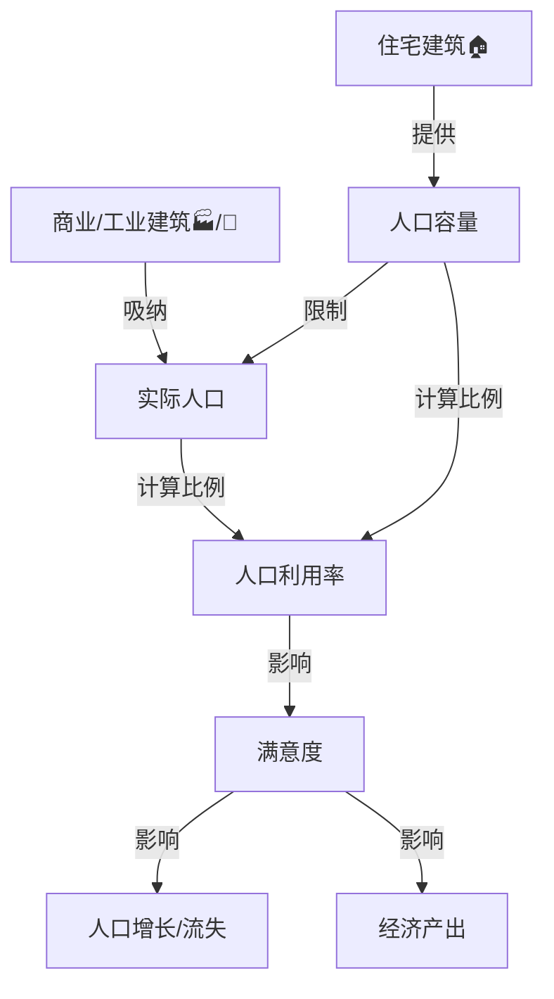

### 4. 满意度影响机制
- **人口利用率 = 实际人口 / 人口容量**
- 当人口利用率 > 1.5 或 < 0.5 时，满意度每分钟下降X点
- 满意度过低时，人口增长变为负数（流失），经济产出下降

### 5. 公式示例
```
实际人口 = min(人口容量, 商业/工业总岗位需求)
人口利用率 = 实际人口 / 人口容量
满意度变化 =
  if (人口利用率 > 1.5 || 人口利用率 < 0.5)
    则满意度 -= Δ
  else
    满意度 += 正常增长
```

> 详见 @src/constants/constants.js 中 BUILDING_DATA 字段定义。

## 2. 金币的产出 & 获取 💰

### 机制说明
- 金币是城市建设与运营的核心资源。
- 金币主要通过商业（🏬、🏢）和工业（🏭、🧪、☢️）建筑按时间周期自动产出。
- 金币消耗主要用于新建筑的建造、升级、搬迁等。
- 产出与消耗数值详见下表。

### 产出与消耗一览表

| 建筑类型 | 建筑名称 | 产出金币/周期 | 建造消耗金币 |
| :--: | :--: | :--: | :--: |
| 工业 | 工厂 🏭 | 20 | 500 |
| 工业 | 化学工厂 🧪 | 30/45/60 | 1000/1500/2000 |
| 工业 | 核电站 ☢️ | 50 | 5000 |
| 商业 | 商店 🏬 | 25/40/60 | 400/800/1600 |
| 商业 | 办公室 🏢 | 35/55/80 | 500/1000/2000 |

> 说明：
> - "产出金币/周期"为该建筑每个时间周期（如每分钟）自动产出的金币数量。
> - "建造消耗金币"为新建该建筑时需要消耗的金币数量。
> - 部分建筑有多级，表格中以"/"分隔不同等级。
> - 详细数据请参考 @src/constants/constants.js 中 BUILDING_DATA。

### 机制细节
- 金币产出受市场需求、满意度等因素影响，详见"动态经济系统"章节。
- 拆除建筑可返还部分金币。
- 随着游戏进程推进，金币产出与消耗会动态调整。

# 未来功能

## 1. 挑战与失败机制

### 1..1 动态经济系统
```js
class Economy {
  constructor() {
    this.marketDemand = {
      residential: 1.0,
      commercial: 1.0,
      industrial: 1.0
    }

    // 每10分钟重新计算市场需求
    setInterval(() => this.calculateMarketDemand(), 600000)
  }

  calculateMarketDemand() {
    // 基于建筑比例调整需求
    const totalBuildings = this.experience.buildings.length
    const resRatio = this.getBuildingRatio('residential')
    const comRatio = this.getBuildingRatio('commercial')

    // 住宅需求公式：商业比例越高，住宅需求越大
    this.marketDemand.residential = 0.5 + comRatio * 1.5

    // 商业需求公式：住宅比例越高，商业需求越大
    this.marketDemand.commercial = 0.3 + resRatio * 2.0

    // 工业需求随机波动
    this.marketDemand.industrial = 0.8 + Math.random() * 0.4
  }

  getBuildingOutput(building) {
    const baseOutput = building.baseOutput
    const demandFactor = this.marketDemand[building.type]
    const efficiency = this.getEfficiency(building)

    return baseOutput * demandFactor * efficiency
  }
}
```

### 1.2 失败条件
```js
class GameState {
  checkFailureConditions() {
    // 条件1: 连续负债超过5分钟
    if (this.credits < 0) {
      this.debtTimer += delta
      if (this.debtTimer > 300) {
        this.triggerFailure('经济崩溃')
      }
    }
    else {
      this.debtTimer = 0
    }

    // 条件2: 人口归零
    if (this.population <= 0) {
      this.triggerFailure('城市荒废')
    }

    // 条件3: 污染爆表
    if (this.pollution >= 100) {
      this.triggerFailure('生态灾难')
    }
  }

  triggerFailure(reason) {
    eventBus.emit('game:over', { reason })
    // 保存分数到排行榜
    this.saveScore()
    // 显示失败界面
    this.showGameOverScreen(reason)
  }
}
```

## 2. 策略性建筑系统

### 2.1 建筑相互依存关系
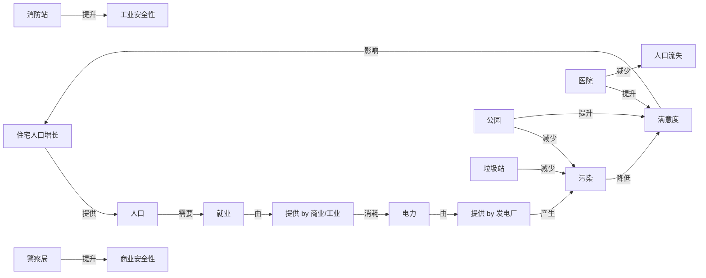

### 2.2 建筑状态指示器系统

#### 2.2.1 状态类型定义
基于 `statusConfig` 配置，建筑可显示以下状态：

| 状态类型 | 触发条件 | 显示图标 | 效果类型 |
|---------|---------|---------|---------|
| `UPGRADE_AVAILABLE` | 建筑可升级且金币充足 | ⬆️ | upgrade |
| `POWER_SHORTAGE` | 城市电力不足 | ⚡ | missPower |
| `POPULATION_OVERLOAD` | 人口超负荷 | 👥 | missPopulation |
| `POPULATION_SHORTAGE` | 人口不足 | 👥 | missPopulation |
| `MISSING_ROAD` | 缺少道路连接 | 🛣️ | missRoad |
| `HIGH_POLLUTION` | 污染过高 | 🌫️ | missPollution |
| `PROVIDING_BUFF` | 为相邻建筑提供增益 | 🌟 | upgrade |

#### 2.2.2 建筑互动配置

**住宅类建筑（house, house2）**
```js
statusConfig: [
  {
    statusType: 'UPGRADE_AVAILABLE',
    condition: (building, gs) => {
      const upgradeInfo = building.upgrade()
      return upgradeInfo && gs.credits >= building.getCost()
    },
    effect: { type: 'upgrade' }
  },
  {
    statusType: 'POPULATION_OVERLOAD',
    condition: (building, gs) => {
      return gs.population >= gs.maxPopulation
    },
    effect: { type: 'humanBuff' }
  }
]
```

**工业类建筑（factory, chemistry-factory, nuke-factory）**
```js
statusConfig: [
  {
    statusType: 'POWER_SHORTAGE',
    condition: (building, gs) => {
      return gs.powerUsage > gs.powerOutput
    },
    effect: { type: 'missPower' }
  },
  {
    statusType: 'MISSING_ROAD',
    condition: (building, _gs) => {
      return !building.hasRoadConnection()
    },
    effect: { type: 'missRoad' }
  },
  {
    statusType: 'HIGH_POLLUTION',
    condition: (building, gs) => {
      return gs.pollution > 80
    },
    effect: { type: 'missPollution' }
  }
]
```

**基础设施类建筑**
```js
// 公园 - 为住宅提供满意度加成
{
  statusType: 'PROVIDING_BUFF',
  condition: (building, gs) => {
    building.buffConfig = { targets: ['house', 'house2'], range: 2 }
    return building.checkForBuffTargets(gs)
  },
  effect: { type: 'upgrade' }
}

// 医院 - 为住宅提供满意度加成
{
  statusType: 'PROVIDING_BUFF',
  condition: (building, gs) => {
    building.buffConfig = { targets: ['house', 'house2'], range: 3 }
    return building.checkForBuffTargets(gs)
  },
  effect: { type: 'upgrade' }
}

// 消防站 - 为工业建筑提供安全性
{
  statusType: 'PROVIDING_BUFF',
  condition: (building, gs) => {
    building.buffConfig = { targets: ['factory', 'chemistry-factory', 'nuke-factory'], range: 2 }
    return building.checkForBuffTargets(gs)
  },
  effect: { type: 'upgrade' }
}

// 警察局 - 为商业建筑提供安全性
{
  statusType: 'PROVIDING_BUFF',
  condition: (building, gs) => {
    building.buffConfig = { targets: ['shop', 'office'], range: 2 }
    return building.checkForBuffTargets(gs)
  },
  effect: { type: 'upgrade' }
}

// 垃圾站 - 为工业建筑减少污染
{
  statusType: 'PROVIDING_BUFF',
  condition: (building, gs) => {
    building.buffConfig = { targets: ['factory', 'chemistry-factory', 'nuke-factory'], range: 2 }
    return building.checkForBuffTargets(gs)
  },
  effect: { type: 'missPollution' }
}
```

### 2.3 建筑升级系统

#### 2.3.1 升级条件
- 建筑达到当前等级上限
- 玩家金币充足
- 城市发展水平满足要求

#### 2.3.2 升级效果
- 人口容量提升（住宅类）
- 金币产出增加（商业/工业类）
- 电力产出提升（发电类）
- 污染减少（基础设施类）

### 2.4 实现规范

#### 2.4.1 状态检测机制
```js
// 在建筑类中实现状态检测
checkStatus(gs) {
  for (const config of this.statusConfig) {
    if (config.condition(this, gs)) {
      return config
    }
  }
  return null
}

// 检查相邻建筑
checkForBuffTargets(gs) {
  const neighbors = this.getNeighborTiles(this.buffConfig.range)
  return neighbors.some(tile =>
    tile.building && this.buffConfig.targets.includes(tile.building.type)
  )
}
```

#### 2.4.2 视觉效果实现
- 使用 `effects.js` 中的广告牌系统
- 状态图标位置：建筑顶部 0.5 单位高度
- 动画效果：缓入缓出 + 浮动动画
- 颜色编码：绿色（正常）、黄色（警告）、红色（危险）

## 3. 动态事件系统

**事件类型表**：
| 事件类型 | 频率       | 影响                | 玩家应对策略           |
| -------- | ---------- | ------------------- | ---------------------- |
| 经济危机 | 10-15分钟  | 所有商业收入减少40% | 转向工业或缩减开支     |
| 移民潮   | 随机       | 人口+20%            | 快速建造住宅提供住所   |
| 能源短缺 | 电力>90%时 | 电力产出-30%        | 建造备用能源或减少消耗 |
| 环保抗议 | 污染>60%时 | 满意度-25%          | 建造公园或升级清洁技术 |
| 技术突破 | 学校>3座时 | 所有升级费用-20%    | 趁机升级关键建筑       |

**事件实现代码**：
```js
class EventSystem {
  constructor() {
    this.events = [
      {
        id: 'economic_crisis',
        name: '全球经济危机',
        probability: 0.01, // 每分钟1%概率
        condition: () => this.experience.playTime > 600, // 10分钟后可能发生
        apply: () => {
          this.marketDemand.commercial *= 0.6
          eventBus.emit('ui:toast', {
            message: '经济危机！商业收入减少40%',
            type: 'warning'
          })
        },
        duration: 120 // 持续2分钟
      }
    ]
  }

  update(delta) {
    this.events.forEach((event) => {
      if (!event.active && Math.random() < event.probability * delta) {
        if (!event.condition || event.condition()) {
          this.activateEvent(event)
        }
      }

      if (event.active) {
        event.timeRemaining -= delta
        if (event.timeRemaining <= 0) {
          this.deactivateEvent(event)
        }
      }
    })
  }
}
```

## 4. 进阶游戏机制

### 5.1 区域规划加成
```js
class ZoneSystem {
  getEfficiencyBonus(building) {
    let bonus = 1.0

    // 检查相邻格子
    const neighbors = this.getNeighborTiles(building.tile)

    // 住宅相邻公园：满意度+10%
    if (building.type === 'residential') {
      const parkCount = neighbors.filter(t => t.building?.type === 'park').length
      bonus += parkCount * 0.1
    }

    // 工厂远离住宅：污染-15%
    if (building.type === 'industrial') {
      const residentialCount = neighbors.filter(t => t.building?.type === 'residential').length
      bonus -= residentialCount * 0.15
    }

    return Math.max(0.5, bonus) // 最低50%效率
  }
}
```

### 5.2 科技树系统
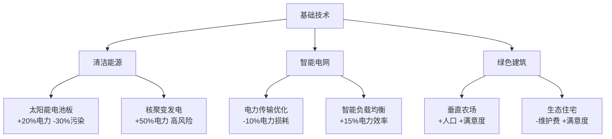

### 5.3 政策系统（二选一机制）
```js
class PolicySystem {
  policies = [
    {
      id: 'tax_policy',
      name: '税收政策',
      options: [
        {
          label: '低税率吸引投资',
          effect: '+20%人口增长，-15%建筑收入'
        },
        {
          label: '高税率增加收入',
          effect: '-10%人口增长，+25%建筑收入'
        }
      ]
    },
    {
      id: 'environment_policy',
      name: '环境政策',
      options: [
        {
          label: '工业优先',
          effect: '+30%工业产出，+0.2污染/分钟'
        },
        {
          label: '环保优先',
          effect: '-50%污染，-20%工业产出'
        }
      ]
    }
  ]

  applyPolicy(policyId, optionIndex) {
    const policy = this.policies.find(p => p.id === policyId)
    const option = policy.options[optionIndex]

    // 应用效果
    this.parseEffect(option.effect)

    // 锁定选择30分钟
    this.policyCooldowns[policyId] = 1800

    eventBus.emit('policy:enacted', { policy, option })
  }
}
```

## 5. 平衡性调整

### 5.1 资源转换公式
```
人口增长 = (基础增长率 + 满意度/100) × (1 - 污染/200)
        × (就业率^0.5) × 住宅容量使用率

电力需求 = Σ(工业建筑×1.2 + 商业建筑×0.8 + 住宅×0.2)
污染产生 = Σ(燃煤发电×0.8 + 工业建筑×0.5 - 公园×0.3)
```

### 5.2 动态难度曲线
```js
class DifficultySystem {
  getDifficultyMultiplier() {
    const timeFactor = Math.min(1.0, this.playTime / 3600) // 1小时后达最大难度
    const buildingFactor = Math.min(1.5, this.buildings.length / 50) // 50建筑后达上限

    return 0.8 + (timeFactor * 0.5) + (buildingFactor * 0.7)
  }

  adjustGameParameters() {
    const multiplier = this.getDifficultyMultiplier()

    // 增加维护成本
    this.maintenanceMultiplier = multiplier

    // 增加事件频率
    this.eventProbabilityMultiplier = 0.5 + multiplier * 0.5

    // 降低资源产出
    this.resourceOutputMultiplier = 1.2 - multiplier * 0.4
  }
}
```

## 6. 玩家进度与成就

### 6.1 里程碑系统
```js
const milestones = [
  { id: 'first_city', name: '初具规模', condition: state => state.population >= 100 },
  { id: 'power_king', name: '电力大亨', condition: state => state.powerOutput >= 500 },
  { id: 'eco_champion', name: '环保先锋', condition: state => state.pollution < 20 && state.playTime > 1800 },
  { id: 'metropolis', name: '大都市', condition: state => state.population >= 5000 }
]
```

### 6.2 保存进度设计
```js
class SaveSystem {
  saveGame() {
    const saveData = {
      version: 1.1,
      timestamp: Date.now(),
      resources: this.experience.resources,
      buildings: this.experience.buildings.map(b => ({
        type: b.type,
        level: b.level,
        x: b.tile.x,
        z: b.tile.z,
        rotation: b.rotation
      })),
      stats: {
        playTime: this.playTime,
        totalEarnings: this.totalEarnings,
        buildingsConstructed: this.buildingsConstructed
      },
      upgrades: this.unlockedUpgrades,
      policies: this.activePolicies
    }

    localStorage.setItem('city_save', JSON.stringify(saveData))
  }

  loadGame() {
    const saveData = JSON.parse(localStorage.getItem('city_save'))
    // 重建游戏状态...
  }
}
```

## 实施路线图

1. **第一阶段：核心经济系统重构（1-2周）**
   - 实现电力、人口、满意度资源
   - 添加建筑维护费
   - 创建基本失败条件

2. **第二阶段：策略深度扩展（2-3周）**
   - 实现区域规划加成
   - 添加基础事件系统
   - 设计初始科技树

3. **第三阶段：内容丰富化（3-4周）**
   - 添加10+新建筑类型
   - 实现政策系统
   - 创建成就和里程碑

4. **第四阶段：平衡与优化（1-2周）**
   - 调整资源公式
   - 优化新玩家引导
   - 添加难度选项

这些改进将游戏从简单的"放置-等待"循环转变为需要持续决策和战略规划的城市模拟游戏。玩家现在需要：
- 平衡多种相互冲突的资源
- 应对随机事件和危机
- 规划长期科技发展
- 在政策决策中权衡取舍
- 避免多个失败条件

同时保持了游戏的休闲本质，所有复杂系统都通过清晰的UI和渐进式引导呈现给玩家。

---

# useGameState.js 变量引用表

> 本文档记录了 `src/stores/useGameState.js` 中所有可用的变量、getters 和 actions，供开发时查询引用。

## State 状态变量

| 变量名 | 类型 | 默认值 | 说明 |
|--------|------|--------|------|
| `currentMode` | string | `'build'` | 当前操作模式：`'build'`、`'demolish'`、`'relocate'`、`'select'` |
| `selectedBuilding` | object/null | `null` | 当前选中建筑：`{type, level}` |
| `selectedPosition` | object/null | `null` | 当前选中位置：`{x, z}` |
| `toastQueue` | array | `[]` | Toast 消息队列 |
| `gameDay` | number | `1` | 游戏天数 |
| `credits` | number | `10000` | 金币数量 |
| `territory` | number | `16` | 地皮数量 |
| `cityLevel` | number | `1` | 城市等级 |
| `cityName` | string | `'HeXian City'` | 城市名称 |
| `citySize` | number | `16` | 城市大小 |
| `language` | string | `'en'` | 语言设置：`'en'`、`'zh'` |
| `metadata` | array | `17x17` 数组 | 地图元数据，每个元素包含：`{type, building, direction, level}` |
| `showMapOverview` | boolean | `false` | 地图总览显示状态 |
| `stability` | number | `100` | 城市稳定度 (0-100) |
| `stabilityChangeRate` | number | `0` | 稳定度每秒变化率 |

## Getters 计算属性

| Getter名 | 返回类型 | 说明 | 计算公式 |
|----------|----------|------|----------|
| `dailyIncome` | number | 每日总收入 | 所有建筑的 `coinOutput` 总和，受相邻公园影响 |
| `maxPopulation` | number | 总人口容量 | 住宅建筑的 `maxPopulation` 总和，受相邻公园影响 |
| `totalJobs` | number | 总就业岗位 | 所有建筑的 `population` 总和 |
| `population` | number | 实际人口 | `Math.min(maxPopulation * 1.5, totalJobs)` |
| `maxPower` | number | 最大发电量 | 所有建筑的 `powerOutput` 总和 |
| `power` | number | 总耗电量 | 所有建筑的 `powerUsage` 总和 |
| `buildingCount` | number | 建筑总数 | 排除道路的建筑数量 |
| `pollution` | number | 总污染值 | 所有建筑的 `pollution` 总和，工业建筑受相邻公园影响 |
| `hospitalCount` | number | 医院数量 | 统计 `building === 'hospital'` 的数量 |
| `policeStationCount` | number | 警察局数量 | 统计 `building === 'police'` 的数量 |
| `fireStationCount` | number | 消防站数量 | 统计 `building === 'fire_station'` 的数量 |

## Actions 操作方法

| Action名 | 参数 | 说明 |
|----------|------|------|
| `updateStability()` | 无 | 更新稳定度变化率 |
| `applyStabilityChange()` | 无 | 应用稳定度变化 |
| `setMode(mode)` | string | 设置操作模式 |
| `setSelectedBuilding(payload)` | object | 设置选中建筑 |
| `setSelectedPosition(position)` | object | 设置选中位置 |
| `setCredits(credits)` | number | 设置金币数量 |
| `updateCredits(credits)` | number | 更新金币数量（增减） |
| `setTerritory(territory)` | number | 设置地皮数量 |
| `setCityLevel(cityLevel)` | number | 设置城市等级 |
| `setCityName(cityName)` | string | 设置城市名称 |
| `setCitySize(citySize)` | number | 设置城市大小 |
| `addToast(message, type)` | string, string | 添加 Toast 消息 |
| `setLanguage(lang)` | string | 设置语言 |
| `removeToast(id)` | number | 移除 Toast 消息 |
| `clearSelection()` | 无 | 清除选中状态 |
| `setTile(x, y, patch)` | number, number, object | 设置地图瓦片 |
| `updateTile(x, y, patch)` | number, number, object | 更新地图瓦片（同 setTile） |
| `getTile(x, y)` | number, number | 获取地图瓦片 |
| `setShowMapOverview(val)` | boolean | 设置地图总览显示 |
| `nextDay()` | 无 | 进入下一天，更新金币 |
| `resetAll()` | 无 | 重置所有状态 |

## 建筑状态检测中的变量引用

在建筑类的 `statusConfig` 中，`gs` 参数代表 `useGameState` 实例，可访问以下属性：

### 常用变量引用示例

```js
// 电力相关
gs.power // 总耗电量 (getter)
gs.maxPower // 最大发电量 (getter)

// 人口相关
gs.population // 实际人口 (getter)
gs.maxPopulation // 总人口容量 (getter)
gs.totalJobs // 总就业岗位 (getter)

// 其他资源
gs.credits // 金币数量 (state)
gs.pollution // 总污染值 (getter)
gs.stability // 城市稳定度 (state)

// 建筑统计
gs.buildingCount // 建筑总数 (getter)
gs.hospitalCount // 医院数量 (getter)
gs.policeStationCount // 警察局数量 (getter)
gs.fireStationCount // 消防站数量 (getter)
```

### 建筑状态配置示例

```js
// 电力短缺检测
{
  statusType: 'POWER_SHORTAGE',
  condition: (building, gs) => {
    return gs.power > gs.maxPower  // 耗电量 > 发电量
  },
  effect: { type: 'missPower' }
}

// 人口超负荷检测
{
  statusType: 'POPULATION_OVERLOAD',
  condition: (building, gs) => {
    return gs.population >= gs.maxPopulation  // 实际人口 >= 人口容量
  },
  effect: { type: 'missPopulation' }
}

// 可升级检测
{
  statusType: 'UPGRADE_AVAILABLE',
  condition: (building, gs) => {
    const upgradeInfo = building.upgrade()
    return upgradeInfo && gs.credits >= building.getCost()  // 有下一级且金币充足
  },
  effect: { type: 'upgrade' }
}
```

## 注意事项

1. **State vs Getter**:
   - `state` 中的变量是直接存储的值
   - `getter` 中的变量是计算得出的值，会实时更新

2. **变量命名一致性**:
   - 电力相关：`power` (耗电量) vs `maxPower` (发电量)
   - 人口相关：`population` (实际人口) vs `maxPopulation` (人口容量)

3. **地图访问**:
   - 使用 `gs.getTile(x, y)` 安全访问地图数据
   - 使用 `gs.setTile(x, y, patch)` 更新地图数据

4. **持久化**:
   - 所有 state 变量都会自动持久化到 localStorage
   - 页面刷新后会自动恢复状态
